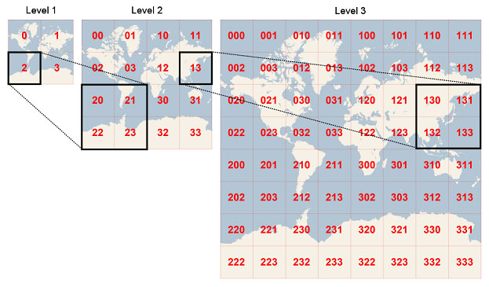

# 基本概念

::: tip 前言
OpenLayers 是一个用于开发 WebGIS 客户端的 JavaScript 包，其设计之意是为互联网客户端提供强大的地图展示功能，包括地图数据显示与相关操作，并具有灵活的扩展机制
:::
:::demo

```vue
<template>
  <div ref="map" class="map"></div>
</template>
<script>
export default {
  mounted() {
    let {
      Map,
      View,
      layer: { WebGLTile: TileLayer },
      source: { OSM },
    } = ol
    new Map({
      target: this.$refs.map,
      layers: [
        new TileLayer({
          source: new OSM(),
        }),
      ],
      view: new View({
        center: [12579156, 3274244],
        zoom: 12,
      }),
    })
  },
}
</script>
```

:::


<xminder />

## 1.Map

地图容器对象，通过 target 参数关联到 div 容器

## 2.View

View 是一个地图组件，在初始化 Map 的时候需要指定一个 View，创建 View 对象的时候，在构造函数中可以传递一个对象，用于指定地图的相关信息：

- 缩放等级
- 中心点
- 投影坐标

## 3.Layer

- Tile 类为瓦片抽象基类，其子类作为各类瓦片数据的数据源

  

从渲染角度来看，openlayers 的图层主要分为两类：Vector（矢量）和 Raster（栅格），矢量图层是指在渲染发生在浏览器的图层，source 返回的数据类型是矢量，如 geojson 的坐标串；栅格图层则是由服务器渲染，返回到浏览器的是一张张的瓦片图片，栅格图层主要用来展示。

- Vector 类为矢量数据源基类，为矢量图层提供具体的数据来源，包括直接组织或读取的矢量数据（Features）、远程数据源的矢量数据（即通过 url 设置数据源路径）等。若是 url 设置的矢量数据源，则通过解析器 Format（即 ol.format.Feature 的子类）来解析各类矢量数据，如 XML、Text、JSON、GML、KML、GPS、WFS、WKT、GeoJSON 等地图数据
- Image 类为单一图像基类，其子类为画布（canvas）元素、服务器图片、单个静态图片、WMS 单一图像等的数据源。它与 Tile 类的区别在于，Image 类对应的是一整张大图片，而不像瓦片那样很多张小图片，从而无需切片，也可以加载一些地图，适用于一些小场景地图

## 4.Controls

- 控件是一个地图上可见的小部件，其 DOM 元素位于屏幕上的固定位置。它们可以包含用户输入（以按钮的形式），也可以只提供信息。控件的位置是使用 CSS 来确定，当然也可以使用 CSS 来调整。默认情况下，控件被放置在地图控件层，也就是 CSS 类名为 ol-overlayContainer-stopEvent 的元素中，但也可以调整，使控件基于外部 DOM 元素来实现

## 5.Overlays

区别于 vector 这样的图层，Overlay 是浮动层的概念

- 弹窗
- 撒点
- gif 图片

## 6.Interactions

它和控件是一样的作用，用来控制地图的。区别是控件触发都是一些**可见**的 HTML 元素触发，如按钮、链接等；交互功能都是一些设备行为触发，都是不可见的，如：

- 鼠标双击
- 滚轮滑动
- 手机设备的手指缩放

## 7.坐标系

openlayers 中获取图层点位坐标方法为

```js
curFeature.getGeometry().getCoordinates() //此方法返回一个数组，x轴与y轴坐标。
```

常用坐标系为 WGS84，全称 World Geodetic System 1984，是为 GPS 全球定位系统使用而建立的坐标系统。

- 投影 projection 有 2 种：
  - 1、EPSG:4326 全球通用
  - 2、EPSG:3857 web 地图专用 openlayers 默认的

:::demo

```vue
<template>
  <h4>EPSG:4326</h4>
  <div id="map4326" class="map"></div>
  <h4>EPSG:3857</h4>
  <div id="map3857" class="map"></div>
</template>

<script>
export default {
  mounted() {
    let {
      Feature,
      geom: {
        Polygon: { circular: circularPolygon },
      },
      Map,
      View,
      layer: { Tile: TileLayer, Vector: VectorLayer },
      source: { TileWMS, Vector: VectorSource },
    } = ol
    const vectorLayer4326 = new VectorLayer({
      source: new VectorSource(),
    })

    const vectorLayer3857 = new VectorLayer({
      source: new VectorSource(),
    })

    const map4326 = new Map({
      layers: [
        new TileLayer({
          source: new TileWMS({
            url: "https://ahocevar.com/geoserver/wms",
            params: {
              LAYERS: "ne:NE1_HR_LC_SR_W_DR",
              TILED: true,
            },
          }),
        }),
        vectorLayer4326,
      ],
      target: "map4326",
      view: new View({
        projection: "EPSG:4326",
        center: [12579156, 3274244],
        zoom: 2,
      }),
    })

    const map3857 = new Map({
      layers: [
        new TileLayer({
          source: new TileWMS({
            url: "https://ahocevar.com/geoserver/wms",
            params: {
              LAYERS: "ne:NE1_HR_LC_SR_W_DR",
              TILED: true,
            },
          }),
        }),
        vectorLayer3857,
      ],
      target: "map3857",
      view: new View({
        center: [12579156, 3274244],
        zoom: 2,
      }),
    })

    const radius = 800000
    let x, y
    for (x = -180; x < 180; x += 30) {
      for (y = -90; y <= 90; y += 30) {
        const circle4326 = circularPolygon([x, y], radius, 64)
        const circle3857 = circle4326
          .clone()
          .transform("EPSG:4326", "EPSG:3857")
        vectorLayer4326.getSource().addFeature(new Feature(circle4326))
        vectorLayer3857.getSource().addFeature(new Feature(circle3857))
      }
    }
  },
}
</script>
```

:::
地图坐标转化

坐标转换，它的第一个参数是 ol.Coordinate 类型的坐标，后面两个参数依次是当前坐标所用的坐标系，及转换后的坐标所用的坐标系，ol.proj.transform([104.06, 30.67], 'EPSG:4326', 'EPSG:3857')就能把 EPSG:4326 的坐标[104.06, 30.67]转换为 EPSG:3857 的坐标。

```js
//第一个参数为第二参数的坐标经纬度 第二个参数为被转化的坐标系  第三个参数为需要被转化为的坐标系
ol.proj.transform([104.06, 30.67], "EPSG:4326", "EPSG:3857")
ol.proj.transform(
  [12964910.690853572, 4884172.646815963],
  "EPSG:3857",
  "EPSG:4326"
)
```

<script>
window.onload = function() {
  alert(1)
};
</script>
